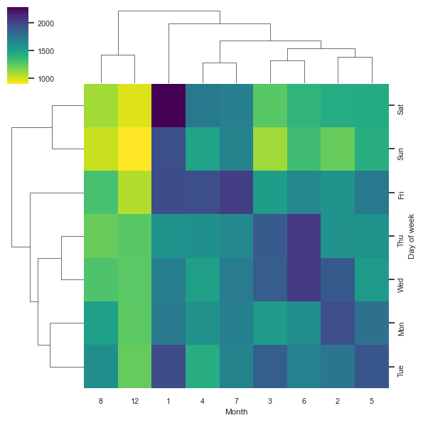

# 911 Calls Data Analysis

## Data and Setup

### Import numpy, pandas, other visualization libraries and set %matplotlib inline


```python
import numpy as np
import pandas as pd
import matplotlib.pyplot as plt
import seaborn as sns
%matplotlib inline
```


```python
plt.rcParams['figure.figsize'] = (4.5,3.5)
sns.set_style('whitegrid')
sns.set_context(context='notebook', font_scale=0.7)
```


```python
df = pd.read_csv('911.csv')
```


```python
df.info()

```

   
    RangeIndex: 99492 entries, 0 to 99491
    Data columns (total 9 columns):
     #   Column     Non-Null Count  Dtype  
    ---  ------     --------------  -----  
     0   lat        99492 non-null  float64
     1   lng        99492 non-null  float64
     2   desc       99492 non-null  object 
     3   zip        86637 non-null  float64
     4   title      99492 non-null  object 
     5   timeStamp  99492 non-null  object 
     6   twp        99449 non-null  object 
     7   addr       98973 non-null  object 
     8   e          99492 non-null  int64  
    dtypes: float64(3), int64(1), object(5)
    memory usage: 6.8+ MB
    


```python
df.head(5)
```


<div>

<table border="1" class="dataframe">
  <thead>
    <tr style="text-align: right;">
      <th></th>
      <th>lat</th>
      <th>lng</th>
      <th>desc</th>
      <th>zip</th>
      <th>title</th>
      <th>timeStamp</th>
      <th>twp</th>
      <th>addr</th>
      <th>e</th>
    </tr>
  </thead>
  <tbody>
    <tr>
      <th>0</th>
      <td>40.297876</td>
      <td>-75.581294</td>
      <td>REINDEER CT &amp; DEAD END;  NEW HANOVER; Station ...</td>
      <td>19525.0</td>
      <td>EMS: BACK PAINS/INJURY</td>
      <td>2015-12-10 17:40:00</td>
      <td>NEW HANOVER</td>
      <td>REINDEER CT &amp; DEAD END</td>
      <td>1</td>
    </tr>
    <tr>
      <th>1</th>
      <td>40.258061</td>
      <td>-75.264680</td>
      <td>BRIAR PATH &amp; WHITEMARSH LN;  HATFIELD TOWNSHIP...</td>
      <td>19446.0</td>
      <td>EMS: DIABETIC EMERGENCY</td>
      <td>2015-12-10 17:40:00</td>
      <td>HATFIELD TOWNSHIP</td>
      <td>BRIAR PATH &amp; WHITEMARSH LN</td>
      <td>1</td>
    </tr>
    <tr>
      <th>2</th>
      <td>40.121182</td>
      <td>-75.351975</td>
      <td>HAWS AVE; NORRISTOWN; 2015-12-10 @ 14:39:21-St...</td>
      <td>19401.0</td>
      <td>Fire: GAS-ODOR/LEAK</td>
      <td>2015-12-10 17:40:00</td>
      <td>NORRISTOWN</td>
      <td>HAWS AVE</td>
      <td>1</td>
    </tr>
    <tr>
      <th>3</th>
      <td>40.116153</td>
      <td>-75.343513</td>
      <td>AIRY ST &amp; SWEDE ST;  NORRISTOWN; Station 308A;...</td>
      <td>19401.0</td>
      <td>EMS: CARDIAC EMERGENCY</td>
      <td>2015-12-10 17:40:01</td>
      <td>NORRISTOWN</td>
      <td>AIRY ST &amp; SWEDE ST</td>
      <td>1</td>
    </tr>
    <tr>
      <th>4</th>
      <td>40.251492</td>
      <td>-75.603350</td>
      <td>CHERRYWOOD CT &amp; DEAD END;  LOWER POTTSGROVE; S...</td>
      <td>NaN</td>
      <td>EMS: DIZZINESS</td>
      <td>2015-12-10 17:40:01</td>
      <td>LOWER POTTSGROVE</td>
      <td>CHERRYWOOD CT &amp; DEAD END</td>
      <td>1</td>
    </tr>
  </tbody>
</table>
</div>


```python
df['e'].value_counts()
```


    e
    1    99492
    Name: count, dtype: int64


### Basic Questions

#### What are the top 5 Zipcodes for 911 calls


```python
df['zip'].value_counts().head(5)
```


    zip
    19401.0    6979
    19464.0    6643
    19403.0    4854
    19446.0    4748
    19406.0    3174
    Name: count, dtype: int64


- These are zip codes where the maximum number of calls are coming from

### What are top 5 townships(twp) for 911 calls?


```python
df['twp'].value_counts().head()
```


    twp
    LOWER MERION    8443
    ABINGTON        5977
    NORRISTOWN      5890
    UPPER MERION    5227
    CHELTENHAM      4575
    Name: count, dtype: int64


#### Take a look at the title column, how many unique title codes are there?


```python
df.nunique()
```


    lat          14579
    lng          14586
    desc         99455
    zip            104
    title          110
    timeStamp    72577
    twp             68
    addr         21914
    e                1
    dtype: int64


```python
df['title'].unique()
```


    array(['EMS: BACK PAINS/INJURY', 'EMS: DIABETIC EMERGENCY',
           'Fire: GAS-ODOR/LEAK', 'EMS: CARDIAC EMERGENCY', 'EMS: DIZZINESS',
           'EMS: HEAD INJURY', 'EMS: NAUSEA/VOMITING',
           'EMS: RESPIRATORY EMERGENCY', 'EMS: SYNCOPAL EPISODE',
           'Traffic: VEHICLE ACCIDENT -', 'EMS: VEHICLE ACCIDENT',
           'Traffic: DISABLED VEHICLE -', 'Fire: APPLIANCE FIRE',
           'EMS: GENERAL WEAKNESS', 'Fire: CARBON MONOXIDE DETECTOR',
           'EMS: UNKNOWN MEDICAL EMERGENCY', 'EMS: UNRESPONSIVE SUBJECT',
           'Fire: VEHICLE ACCIDENT', 'EMS: ALTERED MENTAL STATUS',
           'Fire: FIRE ALARM', 'EMS: CVA/STROKE',
           'Traffic: ROAD OBSTRUCTION -', 'EMS: SUBJECT IN PAIN',
           'EMS: HEMORRHAGING', 'EMS: FALL VICTIM', 'EMS: ASSAULT VICTIM',
           'EMS: SEIZURES', 'EMS: MEDICAL ALERT ALARM',
           'EMS: ABDOMINAL PAINS', 'Fire: PUMP DETAIL',
           'Fire: FIRE INVESTIGATION', 'EMS: OVERDOSE', 'EMS: MATERNITY',
           'EMS: UNCONSCIOUS SUBJECT', 'EMS: CHOKING', 'EMS: LACERATIONS',
           'Fire: TRASH/DUMPSTER FIRE', 'Fire: UNKNOWN TYPE FIRE',
           'Fire: BUILDING FIRE', 'Fire: ELECTRICAL FIRE OUTSIDE',
           'Fire: DEBRIS/FLUIDS ON HIGHWAY',
           'Traffic: DEBRIS/FLUIDS ON HIGHWAY -', 'EMS: FEVER',
           'EMS: ALLERGIC REACTION', 'Traffic: VEHICLE LEAKING FUEL -',
           'EMS: FRACTURE', 'Fire: BURN VICTIM', 'EMS: BURN VICTIM',
           'Fire: RESCUE - GENERAL', 'Fire: WOODS/FIELD FIRE',
           'EMS: RESCUE - GENERAL', 'Fire: FIRE SPECIAL SERVICE',
           'Fire: VEHICLE FIRE', 'Traffic: VEHICLE FIRE -',
           'EMS: WARRANT SERVICE', 'Fire: S/B AT HELICOPTER LANDING',
           'EMS: EMS SPECIAL SERVICE', 'Traffic: HAZARDOUS ROAD CONDITIONS -',
           'Fire: RESCUE - ELEVATOR', 'EMS: FIRE SPECIAL SERVICE',
           'EMS: DEHYDRATION', 'EMS: CARBON MONOXIDE DETECTOR',
           'EMS: BUILDING FIRE', 'EMS: APPLIANCE FIRE', 'EMS: SHOOTING',
           'EMS: POISONING', 'Fire: TRANSFERRED CALL',
           'Fire: RESCUE - TECHNICAL', 'EMS: RESCUE - TECHNICAL',
           'Fire: VEHICLE LEAKING FUEL', 'EMS: EYE INJURY',
           'EMS: ELECTROCUTION', 'EMS: STABBING', 'Fire: FIRE POLICE NEEDED',
           'EMS: AMPUTATION', 'EMS: ANIMAL BITE', 'EMS: FIRE ALARM',
           'EMS: VEHICLE FIRE', 'EMS: HAZARDOUS MATERIALS INCIDENT',
           'EMS: RESCUE - ELEVATOR', 'EMS: FIRE INVESTIGATION',
           'Fire: MEDICAL ALERT ALARM', 'EMS: UNKNOWN TYPE FIRE',
           'EMS: GAS-ODOR/LEAK', 'Fire: TRAIN CRASH',
           'Fire: HAZARDOUS MATERIALS INCIDENT', 'EMS: TRANSFERRED CALL',
           'EMS: TRAIN CRASH', 'EMS: RESCUE - WATER',
           'EMS: S/B AT HELICOPTER LANDING',
           'Fire: UNKNOWN MEDICAL EMERGENCY', 'Fire: RESCUE - WATER',
           'EMS: CARDIAC ARREST', 'EMS: PLANE CRASH', 'Fire: PLANE CRASH',
           'EMS: WOODS/FIELD FIRE', 'Fire: CARDIAC ARREST',
           'Fire: EMS SPECIAL SERVICE', 'Fire: UNCONSCIOUS SUBJECT',
           'EMS: HEAT EXHAUSTION', 'EMS: DEBRIS/FLUIDS ON HIGHWAY',
           'EMS: ACTIVE SHOOTER', 'EMS: DISABLED VEHICLE',
           'Fire: POLICE INFORMATION', 'Fire: DIABETIC EMERGENCY',
           'EMS: BOMB DEVICE FOUND', 'Fire: SYNCOPAL EPISODE',
           'EMS: INDUSTRIAL ACCIDENT', 'EMS: DROWNING', 'EMS: SUSPICIOUS'],
          dtype=object)


```python
len(df['title'].unique())
```


    110


## Creating new features

#### In the titles column there are 'Reasons/Departments" specified before the title code. These are EMS, Fire and Traffic. Use .apply() with a custom lambda expression to create a new column called "Reason " that contains this string values.

#### For Example, If the title column value is EMS: BACK PAINS/INJURY, the reason column value should be EMS.


```python
df['Reason'] = df['title'].apply(lambda x:x.split(':')[0])
df['Reason']
```


    0            EMS
    1            EMS
    2           Fire
    3            EMS
    4            EMS
              ...   
    99487    Traffic
    99488    Traffic
    99489        EMS
    99490        EMS
    99491    Traffic
    Name: Reason, Length: 99492, dtype: object


```python
df
```


<table border="1" class="dataframe">
  <thead>
    <tr style="text-align: right;">
      <th></th>
      <th>lat</th>
      <th>lng</th>
      <th>desc</th>
      <th>zip</th>
      <th>title</th>
      <th>timeStamp</th>
      <th>twp</th>
      <th>addr</th>
      <th>e</th>
      <th>Reason</th>
    </tr>
  </thead>
  <tbody>
    <tr>
      <th>0</th>
      <td>40.297876</td>
      <td>-75.581294</td>
      <td>REINDEER CT &amp; DEAD END;  NEW HANOVER; Station ...</td>
      <td>19525.0</td>
      <td>EMS: BACK PAINS/INJURY</td>
      <td>2015-12-10 17:40:00</td>
      <td>NEW HANOVER</td>
      <td>REINDEER CT &amp; DEAD END</td>
      <td>1</td>
      <td>EMS</td>
    </tr>
    <tr>
      <th>1</th>
      <td>40.258061</td>
      <td>-75.264680</td>
      <td>BRIAR PATH &amp; WHITEMARSH LN;  HATFIELD TOWNSHIP...</td>
      <td>19446.0</td>
      <td>EMS: DIABETIC EMERGENCY</td>
      <td>2015-12-10 17:40:00</td>
      <td>HATFIELD TOWNSHIP</td>
      <td>BRIAR PATH &amp; WHITEMARSH LN</td>
      <td>1</td>
      <td>EMS</td>
    </tr>
    <tr>
      <th>2</th>
      <td>40.121182</td>
      <td>-75.351975</td>
      <td>HAWS AVE; NORRISTOWN; 2015-12-10 @ 14:39:21-St...</td>
      <td>19401.0</td>
      <td>Fire: GAS-ODOR/LEAK</td>
      <td>2015-12-10 17:40:00</td>
      <td>NORRISTOWN</td>
      <td>HAWS AVE</td>
      <td>1</td>
      <td>Fire</td>
    </tr>
    <tr>
      <th>3</th>
      <td>40.116153</td>
      <td>-75.343513</td>
      <td>AIRY ST &amp; SWEDE ST;  NORRISTOWN; Station 308A;...</td>
      <td>19401.0</td>
      <td>EMS: CARDIAC EMERGENCY</td>
      <td>2015-12-10 17:40:01</td>
      <td>NORRISTOWN</td>
      <td>AIRY ST &amp; SWEDE ST</td>
      <td>1</td>
      <td>EMS</td>
    </tr>
    <tr>
      <th>4</th>
      <td>40.251492</td>
      <td>-75.603350</td>
      <td>CHERRYWOOD CT &amp; DEAD END;  LOWER POTTSGROVE; S...</td>
      <td>NaN</td>
      <td>EMS: DIZZINESS</td>
      <td>2015-12-10 17:40:01</td>
      <td>LOWER POTTSGROVE</td>
      <td>CHERRYWOOD CT &amp; DEAD END</td>
      <td>1</td>
      <td>EMS</td>
    </tr>
    <tr>
      <th>...</th>
      <td>...</td>
      <td>...</td>
      <td>...</td>
      <td>...</td>
      <td>...</td>
      <td>...</td>
      <td>...</td>
      <td>...</td>
      <td>...</td>
      <td>...</td>
    </tr>
    <tr>
      <th>99487</th>
      <td>40.132869</td>
      <td>-75.333515</td>
      <td>MARKLEY ST &amp; W LOGAN ST; NORRISTOWN; 2016-08-2...</td>
      <td>19401.0</td>
      <td>Traffic: VEHICLE ACCIDENT -</td>
      <td>2016-08-24 11:06:00</td>
      <td>NORRISTOWN</td>
      <td>MARKLEY ST &amp; W LOGAN ST</td>
      <td>1</td>
      <td>Traffic</td>
    </tr>
    <tr>
      <th>99488</th>
      <td>40.006974</td>
      <td>-75.289080</td>
      <td>LANCASTER AVE &amp; RITTENHOUSE PL; LOWER MERION; ...</td>
      <td>19003.0</td>
      <td>Traffic: VEHICLE ACCIDENT -</td>
      <td>2016-08-24 11:07:02</td>
      <td>LOWER MERION</td>
      <td>LANCASTER AVE &amp; RITTENHOUSE PL</td>
      <td>1</td>
      <td>Traffic</td>
    </tr>
    <tr>
      <th>99489</th>
      <td>40.115429</td>
      <td>-75.334679</td>
      <td>CHESTNUT ST &amp; WALNUT ST;  NORRISTOWN; Station ...</td>
      <td>19401.0</td>
      <td>EMS: FALL VICTIM</td>
      <td>2016-08-24 11:12:00</td>
      <td>NORRISTOWN</td>
      <td>CHESTNUT ST &amp; WALNUT ST</td>
      <td>1</td>
      <td>EMS</td>
    </tr>
    <tr>
      <th>99490</th>
      <td>40.186431</td>
      <td>-75.192555</td>
      <td>WELSH RD &amp; WEBSTER LN;  HORSHAM; Station 352; ...</td>
      <td>19002.0</td>
      <td>EMS: NAUSEA/VOMITING</td>
      <td>2016-08-24 11:17:01</td>
      <td>HORSHAM</td>
      <td>WELSH RD &amp; WEBSTER LN</td>
      <td>1</td>
      <td>EMS</td>
    </tr>
    <tr>
      <th>99491</th>
      <td>40.207055</td>
      <td>-75.317952</td>
      <td>MORRIS RD &amp; S BROAD ST; UPPER GWYNEDD; 2016-08...</td>
      <td>19446.0</td>
      <td>Traffic: VEHICLE ACCIDENT -</td>
      <td>2016-08-24 11:17:02</td>
      <td>UPPER GWYNEDD</td>
      <td>MORRIS RD &amp; S BROAD ST</td>
      <td>1</td>
      <td>Traffic</td>
    </tr>
  </tbody>
</table>
<p>99492 rows × 10 columns</p>
</div>


#### What is the most common Reason for a 911 call based off this new column(Reason)


```python
values = df['timeStamp'].value_counts()
values
```


    timeStamp
    2015-12-10 17:40:01    8
    2016-04-21 17:57:01    7
    2015-12-23 14:12:01    7
    2016-02-14 14:02:01    6
    2016-03-09 16:57:01    6
                          ..
    2016-03-18 11:01:01    1
    2016-03-18 11:02:00    1
    2016-03-18 11:02:01    1
    2016-03-18 11:07:01    1
    2016-08-24 11:17:02    1
    Name: count, Length: 72577, dtype: int64


#### Now use seaborn to create a countplot of 911 calls by Reason


```python
sns.countplot(data = df, x= 'Reason', palette='viridis');
```

    


    

    


- If you look at the calls for EMS it is around 48k
- For fire it was 13-15k
- For Traffic it was >30k and and <36k

#### Now let us begin to focus on time information. What is the data type of the objects in the time Stamp column?


```python
df['timeStamp'].dtype
print(df['timeStamp'].dtype)
```

    object
    


```python
type(df['timeStamp'][0])
```


    str


#### Use pd.to_datetime to convert the column fro strings to Date Time Objects.


```python

df['timeStamp'] = pd.to_datetime(df['timeStamp'])
```


```python
df['timeStamp'].dtype
```


    dtype('<M8[ns]')


```python
type(df['timeStamp'][0])
```


    pandas._libs.tslibs.timestamps.Timestamp


#### You can no wgrab specific attributes from a Datetime object by caling them . For example

 time = df['timeStamp'].iloc[0]

 time.hour

#### We can use jupyters tab method to explore the various attributes that we can call>Now that the timestamp column are actually DateTime Objects , use .apply to create 3 new columns called Hour, Month and Day of week. You will create this columns based off of the timeStamp column.


```python
df['timeStamp']
```


    0       2015-12-10 17:40:00
    1       2015-12-10 17:40:00
    2       2015-12-10 17:40:00
    3       2015-12-10 17:40:01
    4       2015-12-10 17:40:01
                    ...        
    99487   2016-08-24 11:06:00
    99488   2016-08-24 11:07:02
    99489   2016-08-24 11:12:00
    99490   2016-08-24 11:17:01
    99491   2016-08-24 11:17:02
    Name: timeStamp, Length: 99492, dtype: datetime64[ns]


```python
df['Hour'] = df['timeStamp'].apply(lambda x: x.hour)
df['Month'] = df['timeStamp'].apply(lambda x: x.month)
df['Day of week'] = df['timeStamp'].apply(lambda x: x.day_of_week)

```


```python
df.head()

```


<table border="1" class="dataframe">
  <thead>
    <tr style="text-align: right;">
      <th></th>
      <th>lat</th>
      <th>lng</th>
      <th>desc</th>
      <th>zip</th>
      <th>title</th>
      <th>timeStamp</th>
      <th>twp</th>
      <th>addr</th>
      <th>e</th>
      <th>Reason</th>
      <th>Hour</th>
      <th>Month</th>
      <th>Day of week</th>
    </tr>
  </thead>
  <tbody>
    <tr>
      <th>0</th>
      <td>40.297876</td>
      <td>-75.581294</td>
      <td>REINDEER CT &amp; DEAD END;  NEW HANOVER; Station ...</td>
      <td>19525.0</td>
      <td>EMS: BACK PAINS/INJURY</td>
      <td>2015-12-10 17:40:00</td>
      <td>NEW HANOVER</td>
      <td>REINDEER CT &amp; DEAD END</td>
      <td>1</td>
      <td>EMS</td>
      <td>17</td>
      <td>12</td>
      <td>3</td>
    </tr>
    <tr>
      <th>1</th>
      <td>40.258061</td>
      <td>-75.264680</td>
      <td>BRIAR PATH &amp; WHITEMARSH LN;  HATFIELD TOWNSHIP...</td>
      <td>19446.0</td>
      <td>EMS: DIABETIC EMERGENCY</td>
      <td>2015-12-10 17:40:00</td>
      <td>HATFIELD TOWNSHIP</td>
      <td>BRIAR PATH &amp; WHITEMARSH LN</td>
      <td>1</td>
      <td>EMS</td>
      <td>17</td>
      <td>12</td>
      <td>3</td>
    </tr>
    <tr>
      <th>2</th>
      <td>40.121182</td>
      <td>-75.351975</td>
      <td>HAWS AVE; NORRISTOWN; 2015-12-10 @ 14:39:21-St...</td>
      <td>19401.0</td>
      <td>Fire: GAS-ODOR/LEAK</td>
      <td>2015-12-10 17:40:00</td>
      <td>NORRISTOWN</td>
      <td>HAWS AVE</td>
      <td>1</td>
      <td>Fire</td>
      <td>17</td>
      <td>12</td>
      <td>3</td>
    </tr>
    <tr>
      <th>3</th>
      <td>40.116153</td>
      <td>-75.343513</td>
      <td>AIRY ST &amp; SWEDE ST;  NORRISTOWN; Station 308A;...</td>
      <td>19401.0</td>
      <td>EMS: CARDIAC EMERGENCY</td>
      <td>2015-12-10 17:40:01</td>
      <td>NORRISTOWN</td>
      <td>AIRY ST &amp; SWEDE ST</td>
      <td>1</td>
      <td>EMS</td>
      <td>17</td>
      <td>12</td>
      <td>3</td>
    </tr>
    <tr>
      <th>4</th>
      <td>40.251492</td>
      <td>-75.603350</td>
      <td>CHERRYWOOD CT &amp; DEAD END;  LOWER POTTSGROVE; S...</td>
      <td>NaN</td>
      <td>EMS: DIZZINESS</td>
      <td>2015-12-10 17:40:01</td>
      <td>LOWER POTTSGROVE</td>
      <td>CHERRYWOOD CT &amp; DEAD END</td>
      <td>1</td>
      <td>EMS</td>
      <td>17</td>
      <td>12</td>
      <td>3</td>
    </tr>
  </tbody>
</table>
</div>


```python
df['Month'].value_counts()


```


    Month
    1     13205
    7     12137
    6     11786
    2     11467
    5     11423
    4     11326
    3     11101
    8      9078
    12     7969
    Name: count, dtype: int64


```python
df['Hour'].value_counts()

```


    Hour
    17    6517
    16    6490
    15    6154
    12    6029
    14    5997
    13    5967
    18    5762
    11    5543
    10    5413
    9     5314
    8     5044
    19    4908
    20    4377
    7     3970
    21    3788
    22    3283
    23    2559
    6     2513
    0     2112
    1     1721
    5     1629
    2     1549
    3     1435
    4     1418
    Name: count, dtype: int64


```python
df['Day of week'].value_counts()
```


    Day of week
    1    15150
    2    14879
    4    14833
    0    14680
    3    14478
    5    13336
    6    12136
    Name: count, dtype: int64


#### Notice how the Day of the Week is an integer 0-6. Use the .map() with this dictionary to map the actual string names of the day of the week:
####                           dmap = {'0' :'Mon', 1:'Tue', 2:'Wed', 3:'Thu', 4:'Fri',5:'Sat', 6:'Sun'}


```python
dmap = {0 :'Mon', 1:'Tue', 2:'Wed', 3:'Thu', 4:'Fri',5:'Sat', 6:'Sun'}
```


```python
df['Day of week'] = df['Day of week'].map(dmap)
```


```python
df.head()

```


<table border="1" class="dataframe">
  <thead>
    <tr style="text-align: right;">
      <th></th>
      <th>lat</th>
      <th>lng</th>
      <th>desc</th>
      <th>zip</th>
      <th>title</th>
      <th>timeStamp</th>
      <th>twp</th>
      <th>addr</th>
      <th>e</th>
      <th>Reason</th>
      <th>Hour</th>
      <th>Month</th>
      <th>Day of week</th>
    </tr>
  </thead>
  <tbody>
    <tr>
      <th>0</th>
      <td>40.297876</td>
      <td>-75.581294</td>
      <td>REINDEER CT &amp; DEAD END;  NEW HANOVER; Station ...</td>
      <td>19525.0</td>
      <td>EMS: BACK PAINS/INJURY</td>
      <td>2015-12-10 17:40:00</td>
      <td>NEW HANOVER</td>
      <td>REINDEER CT &amp; DEAD END</td>
      <td>1</td>
      <td>EMS</td>
      <td>17</td>
      <td>12</td>
      <td>Thu</td>
    </tr>
    <tr>
      <th>1</th>
      <td>40.258061</td>
      <td>-75.264680</td>
      <td>BRIAR PATH &amp; WHITEMARSH LN;  HATFIELD TOWNSHIP...</td>
      <td>19446.0</td>
      <td>EMS: DIABETIC EMERGENCY</td>
      <td>2015-12-10 17:40:00</td>
      <td>HATFIELD TOWNSHIP</td>
      <td>BRIAR PATH &amp; WHITEMARSH LN</td>
      <td>1</td>
      <td>EMS</td>
      <td>17</td>
      <td>12</td>
      <td>Thu</td>
    </tr>
    <tr>
      <th>2</th>
      <td>40.121182</td>
      <td>-75.351975</td>
      <td>HAWS AVE; NORRISTOWN; 2015-12-10 @ 14:39:21-St...</td>
      <td>19401.0</td>
      <td>Fire: GAS-ODOR/LEAK</td>
      <td>2015-12-10 17:40:00</td>
      <td>NORRISTOWN</td>
      <td>HAWS AVE</td>
      <td>1</td>
      <td>Fire</td>
      <td>17</td>
      <td>12</td>
      <td>Thu</td>
    </tr>
    <tr>
      <th>3</th>
      <td>40.116153</td>
      <td>-75.343513</td>
      <td>AIRY ST &amp; SWEDE ST;  NORRISTOWN; Station 308A;...</td>
      <td>19401.0</td>
      <td>EMS: CARDIAC EMERGENCY</td>
      <td>2015-12-10 17:40:01</td>
      <td>NORRISTOWN</td>
      <td>AIRY ST &amp; SWEDE ST</td>
      <td>1</td>
      <td>EMS</td>
      <td>17</td>
      <td>12</td>
      <td>Thu</td>
    </tr>
    <tr>
      <th>4</th>
      <td>40.251492</td>
      <td>-75.603350</td>
      <td>CHERRYWOOD CT &amp; DEAD END;  LOWER POTTSGROVE; S...</td>
      <td>NaN</td>
      <td>EMS: DIZZINESS</td>
      <td>2015-12-10 17:40:01</td>
      <td>LOWER POTTSGROVE</td>
      <td>CHERRYWOOD CT &amp; DEAD END</td>
      <td>1</td>
      <td>EMS</td>
      <td>17</td>
      <td>12</td>
      <td>Thu</td>
    </tr>
  </tbody>
</table>
</div>


```python
df['Day of week'].value_counts()
```


    Day of week
    Tue    15150
    Wed    14879
    Fri    14833
    Mon    14680
    Thu    14478
    Sat    13336
    Sun    12136
    Name: count, dtype: int64


#### Now use Seaborn to create a countplot of the Day of the week column with the hue based off of the reason column.


```python
sns.countplot(data = df , x = 'Day of week', hue ='Reason', palette = 'viridis')
plt.legend(bbox_to_anchor=(1,1))
```


   


    

    


```python
sns.countplot(data = df , x = 'Month', hue ='Reason', palette = 'viridis')
plt.legend(bbox_to_anchor=(1.25,1))
```


    


    

    


#### Did you notice anything strange about the plot?

- You should have notice that some months(sep,oct, and Nov) are missing lets see if we can fill the information by plotting the information in another way, possiby a simple line plot that fills in the missing months, in order to do this , we need to work with pandas again.

#### Now create a groupby object called byMonth, where you group the dataframe by the month column and use the count method for aggregation. Use the head() method on this returned DataFrame.


```python
byMonth = df.groupby('Month').count()
byMonth
```


<table border="1" class="dataframe">
  <thead>
    <tr style="text-align: right;">
      <th></th>
      <th>lat</th>
      <th>lng</th>
      <th>desc</th>
      <th>zip</th>
      <th>title</th>
      <th>timeStamp</th>
      <th>twp</th>
      <th>addr</th>
      <th>e</th>
      <th>Reason</th>
      <th>Hour</th>
      <th>Day of week</th>
    </tr>
    <tr>
      <th>Month</th>
      <th></th>
      <th></th>
      <th></th>
      <th></th>
      <th></th>
      <th></th>
      <th></th>
      <th></th>
      <th></th>
      <th></th>
      <th></th>
      <th></th>
    </tr>
  </thead>
  <tbody>
    <tr>
      <th>1</th>
      <td>13205</td>
      <td>13205</td>
      <td>13205</td>
      <td>11527</td>
      <td>13205</td>
      <td>13205</td>
      <td>13203</td>
      <td>13096</td>
      <td>13205</td>
      <td>13205</td>
      <td>13205</td>
      <td>13205</td>
    </tr>
    <tr>
      <th>2</th>
      <td>11467</td>
      <td>11467</td>
      <td>11467</td>
      <td>9930</td>
      <td>11467</td>
      <td>11467</td>
      <td>11465</td>
      <td>11396</td>
      <td>11467</td>
      <td>11467</td>
      <td>11467</td>
      <td>11467</td>
    </tr>
    <tr>
      <th>3</th>
      <td>11101</td>
      <td>11101</td>
      <td>11101</td>
      <td>9755</td>
      <td>11101</td>
      <td>11101</td>
      <td>11092</td>
      <td>11059</td>
      <td>11101</td>
      <td>11101</td>
      <td>11101</td>
      <td>11101</td>
    </tr>
    <tr>
      <th>4</th>
      <td>11326</td>
      <td>11326</td>
      <td>11326</td>
      <td>9895</td>
      <td>11326</td>
      <td>11326</td>
      <td>11323</td>
      <td>11283</td>
      <td>11326</td>
      <td>11326</td>
      <td>11326</td>
      <td>11326</td>
    </tr>
    <tr>
      <th>5</th>
      <td>11423</td>
      <td>11423</td>
      <td>11423</td>
      <td>9946</td>
      <td>11423</td>
      <td>11423</td>
      <td>11420</td>
      <td>11378</td>
      <td>11423</td>
      <td>11423</td>
      <td>11423</td>
      <td>11423</td>
    </tr>
    <tr>
      <th>6</th>
      <td>11786</td>
      <td>11786</td>
      <td>11786</td>
      <td>10212</td>
      <td>11786</td>
      <td>11786</td>
      <td>11777</td>
      <td>11732</td>
      <td>11786</td>
      <td>11786</td>
      <td>11786</td>
      <td>11786</td>
    </tr>
    <tr>
      <th>7</th>
      <td>12137</td>
      <td>12137</td>
      <td>12137</td>
      <td>10633</td>
      <td>12137</td>
      <td>12137</td>
      <td>12133</td>
      <td>12088</td>
      <td>12137</td>
      <td>12137</td>
      <td>12137</td>
      <td>12137</td>
    </tr>
    <tr>
      <th>8</th>
      <td>9078</td>
      <td>9078</td>
      <td>9078</td>
      <td>7832</td>
      <td>9078</td>
      <td>9078</td>
      <td>9073</td>
      <td>9025</td>
      <td>9078</td>
      <td>9078</td>
      <td>9078</td>
      <td>9078</td>
    </tr>
    <tr>
      <th>12</th>
      <td>7969</td>
      <td>7969</td>
      <td>7969</td>
      <td>6907</td>
      <td>7969</td>
      <td>7969</td>
      <td>7963</td>
      <td>7916</td>
      <td>7969</td>
      <td>7969</td>
      <td>7969</td>
      <td>7969</td>
    </tr>
  </tbody>
</table>
</div>


#### Now create a simple plot off the dataframe indicating the count of calls per month?      


```python
byMonth.plot(kind='line', y='e', legend = False, xlim=(0,12))
```


    


    

    


- What we see here is number of calls comes down from january and goes up again during the summer months and and falls of drastically off October and december months.
- This also produces an estimated value for the number of calls, for the missing months.

#### Now see if you can use seaborn's lmplot to create a linear fit on the number per month.Keep in mind you may need to reset the index to a column.


```python
byMonth.reset_index(inplace=True)
byMonth
```


<table border="1" class="dataframe">
  <thead>
    <tr style="text-align: right;">
      <th></th>
      <th>Month</th>
      <th>lat</th>
      <th>lng</th>
      <th>desc</th>
      <th>zip</th>
      <th>title</th>
      <th>timeStamp</th>
      <th>twp</th>
      <th>addr</th>
      <th>e</th>
      <th>Reason</th>
      <th>Hour</th>
      <th>Day of week</th>
    </tr>
  </thead>
  <tbody>
    <tr>
      <th>0</th>
      <td>1</td>
      <td>13205</td>
      <td>13205</td>
      <td>13205</td>
      <td>11527</td>
      <td>13205</td>
      <td>13205</td>
      <td>13203</td>
      <td>13096</td>
      <td>13205</td>
      <td>13205</td>
      <td>13205</td>
      <td>13205</td>
    </tr>
    <tr>
      <th>1</th>
      <td>2</td>
      <td>11467</td>
      <td>11467</td>
      <td>11467</td>
      <td>9930</td>
      <td>11467</td>
      <td>11467</td>
      <td>11465</td>
      <td>11396</td>
      <td>11467</td>
      <td>11467</td>
      <td>11467</td>
      <td>11467</td>
    </tr>
    <tr>
      <th>2</th>
      <td>3</td>
      <td>11101</td>
      <td>11101</td>
      <td>11101</td>
      <td>9755</td>
      <td>11101</td>
      <td>11101</td>
      <td>11092</td>
      <td>11059</td>
      <td>11101</td>
      <td>11101</td>
      <td>11101</td>
      <td>11101</td>
    </tr>
    <tr>
      <th>3</th>
      <td>4</td>
      <td>11326</td>
      <td>11326</td>
      <td>11326</td>
      <td>9895</td>
      <td>11326</td>
      <td>11326</td>
      <td>11323</td>
      <td>11283</td>
      <td>11326</td>
      <td>11326</td>
      <td>11326</td>
      <td>11326</td>
    </tr>
    <tr>
      <th>4</th>
      <td>5</td>
      <td>11423</td>
      <td>11423</td>
      <td>11423</td>
      <td>9946</td>
      <td>11423</td>
      <td>11423</td>
      <td>11420</td>
      <td>11378</td>
      <td>11423</td>
      <td>11423</td>
      <td>11423</td>
      <td>11423</td>
    </tr>
    <tr>
      <th>5</th>
      <td>6</td>
      <td>11786</td>
      <td>11786</td>
      <td>11786</td>
      <td>10212</td>
      <td>11786</td>
      <td>11786</td>
      <td>11777</td>
      <td>11732</td>
      <td>11786</td>
      <td>11786</td>
      <td>11786</td>
      <td>11786</td>
    </tr>
    <tr>
      <th>6</th>
      <td>7</td>
      <td>12137</td>
      <td>12137</td>
      <td>12137</td>
      <td>10633</td>
      <td>12137</td>
      <td>12137</td>
      <td>12133</td>
      <td>12088</td>
      <td>12137</td>
      <td>12137</td>
      <td>12137</td>
      <td>12137</td>
    </tr>
    <tr>
      <th>7</th>
      <td>8</td>
      <td>9078</td>
      <td>9078</td>
      <td>9078</td>
      <td>7832</td>
      <td>9078</td>
      <td>9078</td>
      <td>9073</td>
      <td>9025</td>
      <td>9078</td>
      <td>9078</td>
      <td>9078</td>
      <td>9078</td>
    </tr>
    <tr>
      <th>8</th>
      <td>12</td>
      <td>7969</td>
      <td>7969</td>
      <td>7969</td>
      <td>6907</td>
      <td>7969</td>
      <td>7969</td>
      <td>7963</td>
      <td>7916</td>
      <td>7969</td>
      <td>7969</td>
      <td>7969</td>
      <td>7969</td>
    </tr>
  </tbody>
</table>
</div>


```python
sns.lmplot(data = byMonth, x = 'Month' ,y= 'e', height=4, scatter_kws= {'s':10}, line_kws={'lw':2}) #scatter_kws-> s represents the size
```


    


    

    


- The shadow represents the error
- What we see is as we go from january to decemeber, The regression analysis is showing that number of calls per month goes lower and lower .
- However if you see the the scattered point it goes down and then it goes up again before it crashes in august and december
- -Thats why its showing a much larger margin of error there over the shadow portion.
- So the actual data points could lie anywhere between 8500 to 12000 for the month October.so it desnt give a good fit here because of this high error.

#### Create a new column called 'Date' that contains the date from the rimestamp column. You will need to use  apply along with the .date() method.


```python
df['Date']= df['timeStamp'].apply(lambda x:x.date())
df['Date']
```


    0        2015-12-10
    1        2015-12-10
    2        2015-12-10
    3        2015-12-10
    4        2015-12-10
                ...    
    99487    2016-08-24
    99488    2016-08-24
    99489    2016-08-24
    99490    2016-08-24
    99491    2016-08-24
    Name: Date, Length: 99492, dtype: object


```python
df.head()
```


<table border="1" class="dataframe">
  <thead>
    <tr style="text-align: right;">
      <th></th>
      <th>lat</th>
      <th>lng</th>
      <th>desc</th>
      <th>zip</th>
      <th>title</th>
      <th>timeStamp</th>
      <th>twp</th>
      <th>addr</th>
      <th>e</th>
      <th>Reason</th>
      <th>Hour</th>
      <th>Month</th>
      <th>Day of week</th>
      <th>Date</th>
    </tr>
  </thead>
  <tbody>
    <tr>
      <th>0</th>
      <td>40.297876</td>
      <td>-75.581294</td>
      <td>REINDEER CT &amp; DEAD END;  NEW HANOVER; Station ...</td>
      <td>19525.0</td>
      <td>EMS: BACK PAINS/INJURY</td>
      <td>2015-12-10 17:40:00</td>
      <td>NEW HANOVER</td>
      <td>REINDEER CT &amp; DEAD END</td>
      <td>1</td>
      <td>EMS</td>
      <td>17</td>
      <td>12</td>
      <td>Thu</td>
      <td>2015-12-10</td>
    </tr>
    <tr>
      <th>1</th>
      <td>40.258061</td>
      <td>-75.264680</td>
      <td>BRIAR PATH &amp; WHITEMARSH LN;  HATFIELD TOWNSHIP...</td>
      <td>19446.0</td>
      <td>EMS: DIABETIC EMERGENCY</td>
      <td>2015-12-10 17:40:00</td>
      <td>HATFIELD TOWNSHIP</td>
      <td>BRIAR PATH &amp; WHITEMARSH LN</td>
      <td>1</td>
      <td>EMS</td>
      <td>17</td>
      <td>12</td>
      <td>Thu</td>
      <td>2015-12-10</td>
    </tr>
    <tr>
      <th>2</th>
      <td>40.121182</td>
      <td>-75.351975</td>
      <td>HAWS AVE; NORRISTOWN; 2015-12-10 @ 14:39:21-St...</td>
      <td>19401.0</td>
      <td>Fire: GAS-ODOR/LEAK</td>
      <td>2015-12-10 17:40:00</td>
      <td>NORRISTOWN</td>
      <td>HAWS AVE</td>
      <td>1</td>
      <td>Fire</td>
      <td>17</td>
      <td>12</td>
      <td>Thu</td>
      <td>2015-12-10</td>
    </tr>
    <tr>
      <th>3</th>
      <td>40.116153</td>
      <td>-75.343513</td>
      <td>AIRY ST &amp; SWEDE ST;  NORRISTOWN; Station 308A;...</td>
      <td>19401.0</td>
      <td>EMS: CARDIAC EMERGENCY</td>
      <td>2015-12-10 17:40:01</td>
      <td>NORRISTOWN</td>
      <td>AIRY ST &amp; SWEDE ST</td>
      <td>1</td>
      <td>EMS</td>
      <td>17</td>
      <td>12</td>
      <td>Thu</td>
      <td>2015-12-10</td>
    </tr>
    <tr>
      <th>4</th>
      <td>40.251492</td>
      <td>-75.603350</td>
      <td>CHERRYWOOD CT &amp; DEAD END;  LOWER POTTSGROVE; S...</td>
      <td>NaN</td>
      <td>EMS: DIZZINESS</td>
      <td>2015-12-10 17:40:01</td>
      <td>LOWER POTTSGROVE</td>
      <td>CHERRYWOOD CT &amp; DEAD END</td>
      <td>1</td>
      <td>EMS</td>
      <td>17</td>
      <td>12</td>
      <td>Thu</td>
      <td>2015-12-10</td>
    </tr>
  </tbody>
</table>
</div>


```python
type(df['Date'][0])
```


     datetime.date


#### Now groupby this Date column with the count() aggregate and create a plot of counts of 911 calls.


```python
byDate = df.groupby('Date').count()
```


```python
byDate
```


<table border="1" class="dataframe">
  <thead>
    <tr style="text-align: right;">
      <th></th>
      <th>lat</th>
      <th>lng</th>
      <th>desc</th>
      <th>zip</th>
      <th>title</th>
      <th>timeStamp</th>
      <th>twp</th>
      <th>addr</th>
      <th>e</th>
      <th>Reason</th>
      <th>Hour</th>
      <th>Month</th>
      <th>Day of week</th>
    </tr>
    <tr>
      <th>Date</th>
      <th></th>
      <th></th>
      <th></th>
      <th></th>
      <th></th>
      <th></th>
      <th></th>
      <th></th>
      <th></th>
      <th></th>
      <th></th>
      <th></th>
      <th></th>
    </tr>
  </thead>
  <tbody>
    <tr>
      <th>2015-12-10</th>
      <td>115</td>
      <td>115</td>
      <td>115</td>
      <td>100</td>
      <td>115</td>
      <td>115</td>
      <td>115</td>
      <td>113</td>
      <td>115</td>
      <td>115</td>
      <td>115</td>
      <td>115</td>
      <td>115</td>
    </tr>
    <tr>
      <th>2015-12-11</th>
      <td>396</td>
      <td>396</td>
      <td>396</td>
      <td>333</td>
      <td>396</td>
      <td>396</td>
      <td>395</td>
      <td>391</td>
      <td>396</td>
      <td>396</td>
      <td>396</td>
      <td>396</td>
      <td>396</td>
    </tr>
    <tr>
      <th>2015-12-12</th>
      <td>403</td>
      <td>403</td>
      <td>403</td>
      <td>333</td>
      <td>403</td>
      <td>403</td>
      <td>403</td>
      <td>401</td>
      <td>403</td>
      <td>403</td>
      <td>403</td>
      <td>403</td>
      <td>403</td>
    </tr>
    <tr>
      <th>2015-12-13</th>
      <td>319</td>
      <td>319</td>
      <td>319</td>
      <td>280</td>
      <td>319</td>
      <td>319</td>
      <td>319</td>
      <td>317</td>
      <td>319</td>
      <td>319</td>
      <td>319</td>
      <td>319</td>
      <td>319</td>
    </tr>
    <tr>
      <th>2015-12-14</th>
      <td>447</td>
      <td>447</td>
      <td>447</td>
      <td>387</td>
      <td>447</td>
      <td>447</td>
      <td>446</td>
      <td>445</td>
      <td>447</td>
      <td>447</td>
      <td>447</td>
      <td>447</td>
      <td>447</td>
    </tr>
    <tr>
      <th>...</th>
      <td>...</td>
      <td>...</td>
      <td>...</td>
      <td>...</td>
      <td>...</td>
      <td>...</td>
      <td>...</td>
      <td>...</td>
      <td>...</td>
      <td>...</td>
      <td>...</td>
      <td>...</td>
      <td>...</td>
    </tr>
    <tr>
      <th>2016-08-20</th>
      <td>328</td>
      <td>328</td>
      <td>328</td>
      <td>279</td>
      <td>328</td>
      <td>328</td>
      <td>328</td>
      <td>327</td>
      <td>328</td>
      <td>328</td>
      <td>328</td>
      <td>328</td>
      <td>328</td>
    </tr>
    <tr>
      <th>2016-08-21</th>
      <td>357</td>
      <td>357</td>
      <td>357</td>
      <td>299</td>
      <td>357</td>
      <td>357</td>
      <td>357</td>
      <td>352</td>
      <td>357</td>
      <td>357</td>
      <td>357</td>
      <td>357</td>
      <td>357</td>
    </tr>
    <tr>
      <th>2016-08-22</th>
      <td>389</td>
      <td>389</td>
      <td>389</td>
      <td>336</td>
      <td>389</td>
      <td>389</td>
      <td>388</td>
      <td>384</td>
      <td>389</td>
      <td>389</td>
      <td>389</td>
      <td>389</td>
      <td>389</td>
    </tr>
    <tr>
      <th>2016-08-23</th>
      <td>439</td>
      <td>439</td>
      <td>439</td>
      <td>390</td>
      <td>439</td>
      <td>439</td>
      <td>439</td>
      <td>437</td>
      <td>439</td>
      <td>439</td>
      <td>439</td>
      <td>439</td>
      <td>439</td>
    </tr>
    <tr>
      <th>2016-08-24</th>
      <td>132</td>
      <td>132</td>
      <td>132</td>
      <td>106</td>
      <td>132</td>
      <td>132</td>
      <td>132</td>
      <td>132</td>
      <td>132</td>
      <td>132</td>
      <td>132</td>
      <td>132</td>
      <td>132</td>
    </tr>
  </tbody>
</table>
<p>259 rows × 13 columns</p>
</div>


```python
byDate.head()
```


<table border="1" class="dataframe">
  <thead>
    <tr style="text-align: right;">
      <th></th>
      <th>lat</th>
      <th>lng</th>
      <th>desc</th>
      <th>zip</th>
      <th>title</th>
      <th>timeStamp</th>
      <th>twp</th>
      <th>addr</th>
      <th>e</th>
      <th>Reason</th>
      <th>Hour</th>
      <th>Month</th>
      <th>Day of week</th>
    </tr>
    <tr>
      <th>Date</th>
      <th></th>
      <th></th>
      <th></th>
      <th></th>
      <th></th>
      <th></th>
      <th></th>
      <th></th>
      <th></th>
      <th></th>
      <th></th>
      <th></th>
      <th></th>
    </tr>
  </thead>
  <tbody>
    <tr>
      <th>2015-12-10</th>
      <td>115</td>
      <td>115</td>
      <td>115</td>
      <td>100</td>
      <td>115</td>
      <td>115</td>
      <td>115</td>
      <td>113</td>
      <td>115</td>
      <td>115</td>
      <td>115</td>
      <td>115</td>
      <td>115</td>
    </tr>
    <tr>
      <th>2015-12-11</th>
      <td>396</td>
      <td>396</td>
      <td>396</td>
      <td>333</td>
      <td>396</td>
      <td>396</td>
      <td>395</td>
      <td>391</td>
      <td>396</td>
      <td>396</td>
      <td>396</td>
      <td>396</td>
      <td>396</td>
    </tr>
    <tr>
      <th>2015-12-12</th>
      <td>403</td>
      <td>403</td>
      <td>403</td>
      <td>333</td>
      <td>403</td>
      <td>403</td>
      <td>403</td>
      <td>401</td>
      <td>403</td>
      <td>403</td>
      <td>403</td>
      <td>403</td>
      <td>403</td>
    </tr>
    <tr>
      <th>2015-12-13</th>
      <td>319</td>
      <td>319</td>
      <td>319</td>
      <td>280</td>
      <td>319</td>
      <td>319</td>
      <td>319</td>
      <td>317</td>
      <td>319</td>
      <td>319</td>
      <td>319</td>
      <td>319</td>
      <td>319</td>
    </tr>
    <tr>
      <th>2015-12-14</th>
      <td>447</td>
      <td>447</td>
      <td>447</td>
      <td>387</td>
      <td>447</td>
      <td>447</td>
      <td>446</td>
      <td>445</td>
      <td>447</td>
      <td>447</td>
      <td>447</td>
      <td>447</td>
      <td>447</td>
    </tr>
  </tbody>
</table>
</div>


```python
byDate.tail()
```


<table border="1" class="dataframe">
  <thead>
    <tr style="text-align: right;">
      <th></th>
      <th>lat</th>
      <th>lng</th>
      <th>desc</th>
      <th>zip</th>
      <th>title</th>
      <th>timeStamp</th>
      <th>twp</th>
      <th>addr</th>
      <th>e</th>
      <th>Reason</th>
      <th>Hour</th>
      <th>Month</th>
      <th>Day of week</th>
    </tr>
    <tr>
      <th>Date</th>
      <th></th>
      <th></th>
      <th></th>
      <th></th>
      <th></th>
      <th></th>
      <th></th>
      <th></th>
      <th></th>
      <th></th>
      <th></th>
      <th></th>
      <th></th>
    </tr>
  </thead>
  <tbody>
    <tr>
      <th>2016-08-20</th>
      <td>328</td>
      <td>328</td>
      <td>328</td>
      <td>279</td>
      <td>328</td>
      <td>328</td>
      <td>328</td>
      <td>327</td>
      <td>328</td>
      <td>328</td>
      <td>328</td>
      <td>328</td>
      <td>328</td>
    </tr>
    <tr>
      <th>2016-08-21</th>
      <td>357</td>
      <td>357</td>
      <td>357</td>
      <td>299</td>
      <td>357</td>
      <td>357</td>
      <td>357</td>
      <td>352</td>
      <td>357</td>
      <td>357</td>
      <td>357</td>
      <td>357</td>
      <td>357</td>
    </tr>
    <tr>
      <th>2016-08-22</th>
      <td>389</td>
      <td>389</td>
      <td>389</td>
      <td>336</td>
      <td>389</td>
      <td>389</td>
      <td>388</td>
      <td>384</td>
      <td>389</td>
      <td>389</td>
      <td>389</td>
      <td>389</td>
      <td>389</td>
    </tr>
    <tr>
      <th>2016-08-23</th>
      <td>439</td>
      <td>439</td>
      <td>439</td>
      <td>390</td>
      <td>439</td>
      <td>439</td>
      <td>439</td>
      <td>437</td>
      <td>439</td>
      <td>439</td>
      <td>439</td>
      <td>439</td>
      <td>439</td>
    </tr>
    <tr>
      <th>2016-08-24</th>
      <td>132</td>
      <td>132</td>
      <td>132</td>
      <td>106</td>
      <td>132</td>
      <td>132</td>
      <td>132</td>
      <td>132</td>
      <td>132</td>
      <td>132</td>
      <td>132</td>
      <td>132</td>
      <td>132</td>
    </tr>
  </tbody>
</table>
</div>


```python

```


```python
byDate.plot(kind='line', y ='e', figsize=(8,4), legend = False)
```


  


    

    


- The data actually starts from 2015 , then it goes till the 8th month i.e, is August of 2016.
- In the begining i have predicted that we might have a missing data in the year 2016 rather this graph explains us that the data starts somewhere in the month of december  in 2015 and continues only till 2016.
- The data starts from 10th of Dec 2015 till 24th of August 2016.
- The number of calls is less in August and Decmeber because we do not have the data of the complete months.
- If you analyse this data this is the total calls byDate,  On any individual day it looks like the total number of calls varies between 300 and 450 calls with spikes on certain days.


#### Now recreate the plot but create 3 separate plots with each plot representing a Reason for the call


```python
byDateTraffic = df[df['Reason'] == 'Traffic'].groupby('Date').count()
byDateTraffic.head()
```


<table border="1" class="dataframe">
  <thead>
    <tr style="text-align: right;">
      <th></th>
      <th>lat</th>
      <th>lng</th>
      <th>desc</th>
      <th>zip</th>
      <th>title</th>
      <th>timeStamp</th>
      <th>twp</th>
      <th>addr</th>
      <th>e</th>
      <th>Reason</th>
      <th>Hour</th>
      <th>Month</th>
      <th>Day of week</th>
    </tr>
    <tr>
      <th>Date</th>
      <th></th>
      <th></th>
      <th></th>
      <th></th>
      <th></th>
      <th></th>
      <th></th>
      <th></th>
      <th></th>
      <th></th>
      <th></th>
      <th></th>
      <th></th>
    </tr>
  </thead>
  <tbody>
    <tr>
      <th>2015-12-10</th>
      <td>43</td>
      <td>43</td>
      <td>43</td>
      <td>35</td>
      <td>43</td>
      <td>43</td>
      <td>43</td>
      <td>41</td>
      <td>43</td>
      <td>43</td>
      <td>43</td>
      <td>43</td>
      <td>43</td>
    </tr>
    <tr>
      <th>2015-12-11</th>
      <td>141</td>
      <td>141</td>
      <td>141</td>
      <td>108</td>
      <td>141</td>
      <td>141</td>
      <td>141</td>
      <td>137</td>
      <td>141</td>
      <td>141</td>
      <td>141</td>
      <td>141</td>
      <td>141</td>
    </tr>
    <tr>
      <th>2015-12-12</th>
      <td>146</td>
      <td>146</td>
      <td>146</td>
      <td>109</td>
      <td>146</td>
      <td>146</td>
      <td>146</td>
      <td>144</td>
      <td>146</td>
      <td>146</td>
      <td>146</td>
      <td>146</td>
      <td>146</td>
    </tr>
    <tr>
      <th>2015-12-13</th>
      <td>78</td>
      <td>78</td>
      <td>78</td>
      <td>54</td>
      <td>78</td>
      <td>78</td>
      <td>78</td>
      <td>76</td>
      <td>78</td>
      <td>78</td>
      <td>78</td>
      <td>78</td>
      <td>78</td>
    </tr>
    <tr>
      <th>2015-12-14</th>
      <td>186</td>
      <td>186</td>
      <td>186</td>
      <td>150</td>
      <td>186</td>
      <td>186</td>
      <td>186</td>
      <td>184</td>
      <td>186</td>
      <td>186</td>
      <td>186</td>
      <td>186</td>
      <td>186</td>
    </tr>
  </tbody>
</table>
</div>


```python
byDateTraffic.plot(kind='line', y='e' , figsize=(8,4), legend=False, title = 'Traffic')
```


   


    

    


- If you see the graph for the traffic reason , the number of calls are varying between 80 and 200 with spikes on certain days.


```python
byDateFire = df[df['Reason'] == 'Fire'].groupby('Date').count()
byDateFire.head()
```


<table border="1" class="dataframe">
  <thead>
    <tr style="text-align: right;">
      <th></th>
      <th>lat</th>
      <th>lng</th>
      <th>desc</th>
      <th>zip</th>
      <th>title</th>
      <th>timeStamp</th>
      <th>twp</th>
      <th>addr</th>
      <th>e</th>
      <th>Reason</th>
      <th>Hour</th>
      <th>Month</th>
      <th>Day of week</th>
    </tr>
    <tr>
      <th>Date</th>
      <th></th>
      <th></th>
      <th></th>
      <th></th>
      <th></th>
      <th></th>
      <th></th>
      <th></th>
      <th></th>
      <th></th>
      <th></th>
      <th></th>
      <th></th>
    </tr>
  </thead>
  <tbody>
    <tr>
      <th>2015-12-10</th>
      <td>15</td>
      <td>15</td>
      <td>15</td>
      <td>13</td>
      <td>15</td>
      <td>15</td>
      <td>15</td>
      <td>15</td>
      <td>15</td>
      <td>15</td>
      <td>15</td>
      <td>15</td>
      <td>15</td>
    </tr>
    <tr>
      <th>2015-12-11</th>
      <td>69</td>
      <td>69</td>
      <td>69</td>
      <td>59</td>
      <td>69</td>
      <td>69</td>
      <td>68</td>
      <td>68</td>
      <td>69</td>
      <td>69</td>
      <td>69</td>
      <td>69</td>
      <td>69</td>
    </tr>
    <tr>
      <th>2015-12-12</th>
      <td>68</td>
      <td>68</td>
      <td>68</td>
      <td>53</td>
      <td>68</td>
      <td>68</td>
      <td>68</td>
      <td>68</td>
      <td>68</td>
      <td>68</td>
      <td>68</td>
      <td>68</td>
      <td>68</td>
    </tr>
    <tr>
      <th>2015-12-13</th>
      <td>51</td>
      <td>51</td>
      <td>51</td>
      <td>48</td>
      <td>51</td>
      <td>51</td>
      <td>51</td>
      <td>51</td>
      <td>51</td>
      <td>51</td>
      <td>51</td>
      <td>51</td>
      <td>51</td>
    </tr>
    <tr>
      <th>2015-12-14</th>
      <td>39</td>
      <td>39</td>
      <td>39</td>
      <td>36</td>
      <td>39</td>
      <td>39</td>
      <td>38</td>
      <td>39</td>
      <td>39</td>
      <td>39</td>
      <td>39</td>
      <td>39</td>
      <td>39</td>
    </tr>
  </tbody>
</table>
</div>


```python
byDateFire.plot(kind='line', y='e' , figsize=(8,4), legend=False, title = 'Fire')
```


   


    

    


- If you see the graph for the Fire reason the number of calls on each day varies in between 30 to 80 calls on a normal days with a spike on certain days.


```python
byDateEMS = df[df['Reason'] == 'EMS'].groupby('Date').count()
byDateEMS.head()
```


<table border="1" class="dataframe">
  <thead>
    <tr style="text-align: right;">
      <th></th>
      <th>lat</th>
      <th>lng</th>
      <th>desc</th>
      <th>zip</th>
      <th>title</th>
      <th>timeStamp</th>
      <th>twp</th>
      <th>addr</th>
      <th>e</th>
      <th>Reason</th>
      <th>Hour</th>
      <th>Month</th>
      <th>Day of week</th>
    </tr>
    <tr>
      <th>Date</th>
      <th></th>
      <th></th>
      <th></th>
      <th></th>
      <th></th>
      <th></th>
      <th></th>
      <th></th>
      <th></th>
      <th></th>
      <th></th>
      <th></th>
      <th></th>
    </tr>
  </thead>
  <tbody>
    <tr>
      <th>2015-12-10</th>
      <td>57</td>
      <td>57</td>
      <td>57</td>
      <td>52</td>
      <td>57</td>
      <td>57</td>
      <td>57</td>
      <td>57</td>
      <td>57</td>
      <td>57</td>
      <td>57</td>
      <td>57</td>
      <td>57</td>
    </tr>
    <tr>
      <th>2015-12-11</th>
      <td>186</td>
      <td>186</td>
      <td>186</td>
      <td>166</td>
      <td>186</td>
      <td>186</td>
      <td>186</td>
      <td>186</td>
      <td>186</td>
      <td>186</td>
      <td>186</td>
      <td>186</td>
      <td>186</td>
    </tr>
    <tr>
      <th>2015-12-12</th>
      <td>189</td>
      <td>189</td>
      <td>189</td>
      <td>171</td>
      <td>189</td>
      <td>189</td>
      <td>189</td>
      <td>189</td>
      <td>189</td>
      <td>189</td>
      <td>189</td>
      <td>189</td>
      <td>189</td>
    </tr>
    <tr>
      <th>2015-12-13</th>
      <td>190</td>
      <td>190</td>
      <td>190</td>
      <td>178</td>
      <td>190</td>
      <td>190</td>
      <td>190</td>
      <td>190</td>
      <td>190</td>
      <td>190</td>
      <td>190</td>
      <td>190</td>
      <td>190</td>
    </tr>
    <tr>
      <th>2015-12-14</th>
      <td>222</td>
      <td>222</td>
      <td>222</td>
      <td>201</td>
      <td>222</td>
      <td>222</td>
      <td>222</td>
      <td>222</td>
      <td>222</td>
      <td>222</td>
      <td>222</td>
      <td>222</td>
      <td>222</td>
    </tr>
  </tbody>
</table>
</div>


```python
byDateEMS.plot(kind = 'line', y = 'e',  figsize=(8,4), legend=False, title = 'EMS');
```


    

    


- Here it looks like the calls vary between 150 and 225 with spikes on downward direction at the end of april or first of may.

#### Now lets move on to creating heatmaps with seaborn and our data. We'll first need to restructure the dataframe so that the columns become the Hours and the Index becomes the day of the week. There are a lots of ways to do this , but I would recommend trying to combine group by with an unstack method.


```python
df.head()
```


<table border="1" class="dataframe">
  <thead>
    <tr style="text-align: right;">
      <th></th>
      <th>lat</th>
      <th>lng</th>
      <th>desc</th>
      <th>zip</th>
      <th>title</th>
      <th>timeStamp</th>
      <th>twp</th>
      <th>addr</th>
      <th>e</th>
      <th>Reason</th>
      <th>Hour</th>
      <th>Month</th>
      <th>Day of week</th>
      <th>Date</th>
    </tr>
  </thead>
  <tbody>
    <tr>
      <th>0</th>
      <td>40.297876</td>
      <td>-75.581294</td>
      <td>REINDEER CT &amp; DEAD END;  NEW HANOVER; Station ...</td>
      <td>19525.0</td>
      <td>EMS: BACK PAINS/INJURY</td>
      <td>2015-12-10 17:40:00</td>
      <td>NEW HANOVER</td>
      <td>REINDEER CT &amp; DEAD END</td>
      <td>1</td>
      <td>EMS</td>
      <td>17</td>
      <td>12</td>
      <td>Thu</td>
      <td>2015-12-10</td>
    </tr>
    <tr>
      <th>1</th>
      <td>40.258061</td>
      <td>-75.264680</td>
      <td>BRIAR PATH &amp; WHITEMARSH LN;  HATFIELD TOWNSHIP...</td>
      <td>19446.0</td>
      <td>EMS: DIABETIC EMERGENCY</td>
      <td>2015-12-10 17:40:00</td>
      <td>HATFIELD TOWNSHIP</td>
      <td>BRIAR PATH &amp; WHITEMARSH LN</td>
      <td>1</td>
      <td>EMS</td>
      <td>17</td>
      <td>12</td>
      <td>Thu</td>
      <td>2015-12-10</td>
    </tr>
    <tr>
      <th>2</th>
      <td>40.121182</td>
      <td>-75.351975</td>
      <td>HAWS AVE; NORRISTOWN; 2015-12-10 @ 14:39:21-St...</td>
      <td>19401.0</td>
      <td>Fire: GAS-ODOR/LEAK</td>
      <td>2015-12-10 17:40:00</td>
      <td>NORRISTOWN</td>
      <td>HAWS AVE</td>
      <td>1</td>
      <td>Fire</td>
      <td>17</td>
      <td>12</td>
      <td>Thu</td>
      <td>2015-12-10</td>
    </tr>
    <tr>
      <th>3</th>
      <td>40.116153</td>
      <td>-75.343513</td>
      <td>AIRY ST &amp; SWEDE ST;  NORRISTOWN; Station 308A;...</td>
      <td>19401.0</td>
      <td>EMS: CARDIAC EMERGENCY</td>
      <td>2015-12-10 17:40:01</td>
      <td>NORRISTOWN</td>
      <td>AIRY ST &amp; SWEDE ST</td>
      <td>1</td>
      <td>EMS</td>
      <td>17</td>
      <td>12</td>
      <td>Thu</td>
      <td>2015-12-10</td>
    </tr>
    <tr>
      <th>4</th>
      <td>40.251492</td>
      <td>-75.603350</td>
      <td>CHERRYWOOD CT &amp; DEAD END;  LOWER POTTSGROVE; S...</td>
      <td>NaN</td>
      <td>EMS: DIZZINESS</td>
      <td>2015-12-10 17:40:01</td>
      <td>LOWER POTTSGROVE</td>
      <td>CHERRYWOOD CT &amp; DEAD END</td>
      <td>1</td>
      <td>EMS</td>
      <td>17</td>
      <td>12</td>
      <td>Thu</td>
      <td>2015-12-10</td>
    </tr>
  </tbody>
</table>
</div>


- The easiest way to do this is using pivot table. If you check the dataframe we have added the new columns Reason, Hour Month and Day of the week and Date. What I want here is, 'Day of week' to be the index and the hour column actually be the columns and the hour varies between 0 to 23.
- So I want 24 columns for each hour of day and seven rows for each day of the week.
- Easiest way to to it is using the pivot table.


```python
df.pivot_table(index = 'Day of week', columns = 'Hour', values = 'e', aggfunc = 'sum')
```


<table border="1" class="dataframe">
  <thead>
    <tr style="text-align: right;">
      <th>Hour</th>
      <th>0</th>
      <th>1</th>
      <th>2</th>
      <th>3</th>
      <th>4</th>
      <th>5</th>
      <th>6</th>
      <th>7</th>
      <th>8</th>
      <th>9</th>
      <th>...</th>
      <th>14</th>
      <th>15</th>
      <th>16</th>
      <th>17</th>
      <th>18</th>
      <th>19</th>
      <th>20</th>
      <th>21</th>
      <th>22</th>
      <th>23</th>
    </tr>
    <tr>
      <th>Day of week</th>
      <th></th>
      <th></th>
      <th></th>
      <th></th>
      <th></th>
      <th></th>
      <th></th>
      <th></th>
      <th></th>
      <th></th>
      <th></th>
      <th></th>
      <th></th>
      <th></th>
      <th></th>
      <th></th>
      <th></th>
      <th></th>
      <th></th>
      <th></th>
      <th></th>
    </tr>
  </thead>
  <tbody>
    <tr>
      <th>Fri</th>
      <td>275</td>
      <td>235</td>
      <td>191</td>
      <td>175</td>
      <td>201</td>
      <td>194</td>
      <td>372</td>
      <td>598</td>
      <td>742</td>
      <td>752</td>
      <td>...</td>
      <td>932</td>
      <td>980</td>
      <td>1039</td>
      <td>980</td>
      <td>820</td>
      <td>696</td>
      <td>667</td>
      <td>559</td>
      <td>514</td>
      <td>474</td>
    </tr>
    <tr>
      <th>Mon</th>
      <td>282</td>
      <td>221</td>
      <td>201</td>
      <td>194</td>
      <td>204</td>
      <td>267</td>
      <td>397</td>
      <td>653</td>
      <td>819</td>
      <td>786</td>
      <td>...</td>
      <td>869</td>
      <td>913</td>
      <td>989</td>
      <td>997</td>
      <td>885</td>
      <td>746</td>
      <td>613</td>
      <td>497</td>
      <td>472</td>
      <td>325</td>
    </tr>
    <tr>
      <th>Sat</th>
      <td>375</td>
      <td>301</td>
      <td>263</td>
      <td>260</td>
      <td>224</td>
      <td>231</td>
      <td>257</td>
      <td>391</td>
      <td>459</td>
      <td>640</td>
      <td>...</td>
      <td>789</td>
      <td>796</td>
      <td>848</td>
      <td>757</td>
      <td>778</td>
      <td>696</td>
      <td>628</td>
      <td>572</td>
      <td>506</td>
      <td>467</td>
    </tr>
    <tr>
      <th>Sun</th>
      <td>383</td>
      <td>306</td>
      <td>286</td>
      <td>268</td>
      <td>242</td>
      <td>240</td>
      <td>300</td>
      <td>402</td>
      <td>483</td>
      <td>620</td>
      <td>...</td>
      <td>684</td>
      <td>691</td>
      <td>663</td>
      <td>714</td>
      <td>670</td>
      <td>655</td>
      <td>537</td>
      <td>461</td>
      <td>415</td>
      <td>330</td>
    </tr>
    <tr>
      <th>Thu</th>
      <td>278</td>
      <td>202</td>
      <td>233</td>
      <td>159</td>
      <td>182</td>
      <td>203</td>
      <td>362</td>
      <td>570</td>
      <td>777</td>
      <td>828</td>
      <td>...</td>
      <td>876</td>
      <td>969</td>
      <td>935</td>
      <td>1013</td>
      <td>810</td>
      <td>698</td>
      <td>617</td>
      <td>553</td>
      <td>424</td>
      <td>354</td>
    </tr>
    <tr>
      <th>Tue</th>
      <td>269</td>
      <td>240</td>
      <td>186</td>
      <td>170</td>
      <td>209</td>
      <td>239</td>
      <td>415</td>
      <td>655</td>
      <td>889</td>
      <td>880</td>
      <td>...</td>
      <td>943</td>
      <td>938</td>
      <td>1026</td>
      <td>1019</td>
      <td>905</td>
      <td>731</td>
      <td>647</td>
      <td>571</td>
      <td>462</td>
      <td>274</td>
    </tr>
    <tr>
      <th>Wed</th>
      <td>250</td>
      <td>216</td>
      <td>189</td>
      <td>209</td>
      <td>156</td>
      <td>255</td>
      <td>410</td>
      <td>701</td>
      <td>875</td>
      <td>808</td>
      <td>...</td>
      <td>904</td>
      <td>867</td>
      <td>990</td>
      <td>1037</td>
      <td>894</td>
      <td>686</td>
      <td>668</td>
      <td>575</td>
      <td>490</td>
      <td>335</td>
    </tr>
  </tbody>
</table>
<p>7 rows × 24 columns</p>
</div>


```python
## Getting the same results using unstack method
## Here we use the groupby method and rather than grouping by single column, we will pass in a list of two columns and that
## will produce a multi index dataframe

df.groupby(['Day of week', 'Hour']).count()
```


<table border="1" class="dataframe">
  <thead>
    <tr style="text-align: right;">
      <th></th>
      <th></th>
      <th>lat</th>
      <th>lng</th>
      <th>desc</th>
      <th>zip</th>
      <th>title</th>
      <th>timeStamp</th>
      <th>twp</th>
      <th>addr</th>
      <th>e</th>
      <th>Reason</th>
      <th>Month</th>
      <th>Date</th>
    </tr>
    <tr>
      <th>Day of week</th>
      <th>Hour</th>
      <th></th>
      <th></th>
      <th></th>
      <th></th>
      <th></th>
      <th></th>
      <th></th>
      <th></th>
      <th></th>
      <th></th>
      <th></th>
      <th></th>
    </tr>
  </thead>
  <tbody>
    <tr>
      <th rowspan="5" valign="top">Fri</th>
      <th>0</th>
      <td>275</td>
      <td>275</td>
      <td>275</td>
      <td>248</td>
      <td>275</td>
      <td>275</td>
      <td>275</td>
      <td>275</td>
      <td>275</td>
      <td>275</td>
      <td>275</td>
      <td>275</td>
    </tr>
    <tr>
      <th>1</th>
      <td>235</td>
      <td>235</td>
      <td>235</td>
      <td>200</td>
      <td>235</td>
      <td>235</td>
      <td>235</td>
      <td>232</td>
      <td>235</td>
      <td>235</td>
      <td>235</td>
      <td>235</td>
    </tr>
    <tr>
      <th>2</th>
      <td>191</td>
      <td>191</td>
      <td>191</td>
      <td>165</td>
      <td>191</td>
      <td>191</td>
      <td>191</td>
      <td>191</td>
      <td>191</td>
      <td>191</td>
      <td>191</td>
      <td>191</td>
    </tr>
    <tr>
      <th>3</th>
      <td>175</td>
      <td>175</td>
      <td>175</td>
      <td>164</td>
      <td>175</td>
      <td>175</td>
      <td>175</td>
      <td>175</td>
      <td>175</td>
      <td>175</td>
      <td>175</td>
      <td>175</td>
    </tr>
    <tr>
      <th>4</th>
      <td>201</td>
      <td>201</td>
      <td>201</td>
      <td>184</td>
      <td>201</td>
      <td>201</td>
      <td>201</td>
      <td>201</td>
      <td>201</td>
      <td>201</td>
      <td>201</td>
      <td>201</td>
    </tr>
    <tr>
      <th>...</th>
      <th>...</th>
      <td>...</td>
      <td>...</td>
      <td>...</td>
      <td>...</td>
      <td>...</td>
      <td>...</td>
      <td>...</td>
      <td>...</td>
      <td>...</td>
      <td>...</td>
      <td>...</td>
      <td>...</td>
    </tr>
    <tr>
      <th rowspan="5" valign="top">Wed</th>
      <th>19</th>
      <td>686</td>
      <td>686</td>
      <td>686</td>
      <td>590</td>
      <td>686</td>
      <td>686</td>
      <td>686</td>
      <td>682</td>
      <td>686</td>
      <td>686</td>
      <td>686</td>
      <td>686</td>
    </tr>
    <tr>
      <th>20</th>
      <td>668</td>
      <td>668</td>
      <td>668</td>
      <td>597</td>
      <td>668</td>
      <td>668</td>
      <td>668</td>
      <td>662</td>
      <td>668</td>
      <td>668</td>
      <td>668</td>
      <td>668</td>
    </tr>
    <tr>
      <th>21</th>
      <td>575</td>
      <td>575</td>
      <td>575</td>
      <td>508</td>
      <td>575</td>
      <td>575</td>
      <td>574</td>
      <td>572</td>
      <td>575</td>
      <td>575</td>
      <td>575</td>
      <td>575</td>
    </tr>
    <tr>
      <th>22</th>
      <td>490</td>
      <td>490</td>
      <td>490</td>
      <td>432</td>
      <td>490</td>
      <td>490</td>
      <td>490</td>
      <td>485</td>
      <td>490</td>
      <td>490</td>
      <td>490</td>
      <td>490</td>
    </tr>
    <tr>
      <th>23</th>
      <td>335</td>
      <td>335</td>
      <td>335</td>
      <td>294</td>
      <td>335</td>
      <td>335</td>
      <td>334</td>
      <td>335</td>
      <td>335</td>
      <td>335</td>
      <td>335</td>
      <td>335</td>
    </tr>
  </tbody>
</table>
<p>168 rows × 12 columns</p>
</div>


- If  we observe the dataframe we can see two indexes here one is 'Day of Week' and 'Hour' for each day of the week


```python
## Lets use unstack on it 

byDayHour = df.groupby(['Day of week', 'Hour']).count()['e'].unstack()
byDayHour

```


<table border="1" class="dataframe">
  <thead>
    <tr style="text-align: right;">
      <th>Hour</th>
      <th>0</th>
      <th>1</th>
      <th>2</th>
      <th>3</th>
      <th>4</th>
      <th>5</th>
      <th>6</th>
      <th>7</th>
      <th>8</th>
      <th>9</th>
      <th>...</th>
      <th>14</th>
      <th>15</th>
      <th>16</th>
      <th>17</th>
      <th>18</th>
      <th>19</th>
      <th>20</th>
      <th>21</th>
      <th>22</th>
      <th>23</th>
    </tr>
    <tr>
      <th>Day of week</th>
      <th></th>
      <th></th>
      <th></th>
      <th></th>
      <th></th>
      <th></th>
      <th></th>
      <th></th>
      <th></th>
      <th></th>
      <th></th>
      <th></th>
      <th></th>
      <th></th>
      <th></th>
      <th></th>
      <th></th>
      <th></th>
      <th></th>
      <th></th>
      <th></th>
    </tr>
  </thead>
  <tbody>
    <tr>
      <th>Fri</th>
      <td>275</td>
      <td>235</td>
      <td>191</td>
      <td>175</td>
      <td>201</td>
      <td>194</td>
      <td>372</td>
      <td>598</td>
      <td>742</td>
      <td>752</td>
      <td>...</td>
      <td>932</td>
      <td>980</td>
      <td>1039</td>
      <td>980</td>
      <td>820</td>
      <td>696</td>
      <td>667</td>
      <td>559</td>
      <td>514</td>
      <td>474</td>
    </tr>
    <tr>
      <th>Mon</th>
      <td>282</td>
      <td>221</td>
      <td>201</td>
      <td>194</td>
      <td>204</td>
      <td>267</td>
      <td>397</td>
      <td>653</td>
      <td>819</td>
      <td>786</td>
      <td>...</td>
      <td>869</td>
      <td>913</td>
      <td>989</td>
      <td>997</td>
      <td>885</td>
      <td>746</td>
      <td>613</td>
      <td>497</td>
      <td>472</td>
      <td>325</td>
    </tr>
    <tr>
      <th>Sat</th>
      <td>375</td>
      <td>301</td>
      <td>263</td>
      <td>260</td>
      <td>224</td>
      <td>231</td>
      <td>257</td>
      <td>391</td>
      <td>459</td>
      <td>640</td>
      <td>...</td>
      <td>789</td>
      <td>796</td>
      <td>848</td>
      <td>757</td>
      <td>778</td>
      <td>696</td>
      <td>628</td>
      <td>572</td>
      <td>506</td>
      <td>467</td>
    </tr>
    <tr>
      <th>Sun</th>
      <td>383</td>
      <td>306</td>
      <td>286</td>
      <td>268</td>
      <td>242</td>
      <td>240</td>
      <td>300</td>
      <td>402</td>
      <td>483</td>
      <td>620</td>
      <td>...</td>
      <td>684</td>
      <td>691</td>
      <td>663</td>
      <td>714</td>
      <td>670</td>
      <td>655</td>
      <td>537</td>
      <td>461</td>
      <td>415</td>
      <td>330</td>
    </tr>
    <tr>
      <th>Thu</th>
      <td>278</td>
      <td>202</td>
      <td>233</td>
      <td>159</td>
      <td>182</td>
      <td>203</td>
      <td>362</td>
      <td>570</td>
      <td>777</td>
      <td>828</td>
      <td>...</td>
      <td>876</td>
      <td>969</td>
      <td>935</td>
      <td>1013</td>
      <td>810</td>
      <td>698</td>
      <td>617</td>
      <td>553</td>
      <td>424</td>
      <td>354</td>
    </tr>
    <tr>
      <th>Tue</th>
      <td>269</td>
      <td>240</td>
      <td>186</td>
      <td>170</td>
      <td>209</td>
      <td>239</td>
      <td>415</td>
      <td>655</td>
      <td>889</td>
      <td>880</td>
      <td>...</td>
      <td>943</td>
      <td>938</td>
      <td>1026</td>
      <td>1019</td>
      <td>905</td>
      <td>731</td>
      <td>647</td>
      <td>571</td>
      <td>462</td>
      <td>274</td>
    </tr>
    <tr>
      <th>Wed</th>
      <td>250</td>
      <td>216</td>
      <td>189</td>
      <td>209</td>
      <td>156</td>
      <td>255</td>
      <td>410</td>
      <td>701</td>
      <td>875</td>
      <td>808</td>
      <td>...</td>
      <td>904</td>
      <td>867</td>
      <td>990</td>
      <td>1037</td>
      <td>894</td>
      <td>686</td>
      <td>668</td>
      <td>575</td>
      <td>490</td>
      <td>335</td>
    </tr>
  </tbody>
</table>
<p>7 rows × 24 columns</p>
</div>


- This is a 7 x 24 df . We have seven days of the week and 24 hours of the day ranging from 0 to 23 and we have the sum that is the count for each row which has 'e' value as 1

#### Now create a HeatMap using this DataFrame.


```python
plt.figure(figsize=(9,5))
sns.heatmap(data = byDayHour, cmap = 'viridis_r');
```


    

    


- If you see the color bar the darker color has the higher value and the lighter color has the lower value.
- We have the days of the week on the y axis and hours of the day on the x axis.
- At midnight i.e, between 01 A.M to 5 A.M the values are lower and if you go through the day from the morning to the afternoon and evening the the colors become darker and darker thrpught the day and starts getting lighter again as you reach 9 P.m, 10 P.m and 11 P.m.
- If you look at the Y axis the days of the week sat and sun has lighter colors compared to the other days of the week
- The number of calls increased as you go through the day.
- Most of the calls have been around three to seven in the evening and similiarly most of the calls happen on the weekdays than on the weekends.


#### Create a clustermap using the dataframe


```python

sns.clustermap(data =byDayHour, cmap= 'viridis_r',figsize=(6, 6));
```


    

    


#### Lets repeat these same plots and operations, for a DataFrame that shows the Month as the column.


```python
byDayMonth = df.groupby(['Day of week', 'Month']).count()['e'].unstack()
byDayMonth
```


<table border="1" class="dataframe">
  <thead>
    <tr style="text-align: right;">
      <th>Month</th>
      <th>1</th>
      <th>2</th>
      <th>3</th>
      <th>4</th>
      <th>5</th>
      <th>6</th>
      <th>7</th>
      <th>8</th>
      <th>12</th>
    </tr>
    <tr>
      <th>Day of week</th>
      <th></th>
      <th></th>
      <th></th>
      <th></th>
      <th></th>
      <th></th>
      <th></th>
      <th></th>
      <th></th>
    </tr>
  </thead>
  <tbody>
    <tr>
      <th>Fri</th>
      <td>1970</td>
      <td>1581</td>
      <td>1525</td>
      <td>1958</td>
      <td>1730</td>
      <td>1649</td>
      <td>2045</td>
      <td>1310</td>
      <td>1065</td>
    </tr>
    <tr>
      <th>Mon</th>
      <td>1727</td>
      <td>1964</td>
      <td>1535</td>
      <td>1598</td>
      <td>1779</td>
      <td>1617</td>
      <td>1692</td>
      <td>1511</td>
      <td>1257</td>
    </tr>
    <tr>
      <th>Sat</th>
      <td>2291</td>
      <td>1441</td>
      <td>1266</td>
      <td>1734</td>
      <td>1444</td>
      <td>1388</td>
      <td>1695</td>
      <td>1099</td>
      <td>978</td>
    </tr>
    <tr>
      <th>Sun</th>
      <td>1960</td>
      <td>1229</td>
      <td>1102</td>
      <td>1488</td>
      <td>1424</td>
      <td>1333</td>
      <td>1672</td>
      <td>1021</td>
      <td>907</td>
    </tr>
    <tr>
      <th>Thu</th>
      <td>1584</td>
      <td>1596</td>
      <td>1900</td>
      <td>1601</td>
      <td>1590</td>
      <td>2065</td>
      <td>1646</td>
      <td>1230</td>
      <td>1266</td>
    </tr>
    <tr>
      <th>Tue</th>
      <td>1973</td>
      <td>1753</td>
      <td>1884</td>
      <td>1430</td>
      <td>1918</td>
      <td>1676</td>
      <td>1670</td>
      <td>1612</td>
      <td>1234</td>
    </tr>
    <tr>
      <th>Wed</th>
      <td>1700</td>
      <td>1903</td>
      <td>1889</td>
      <td>1517</td>
      <td>1538</td>
      <td>2058</td>
      <td>1717</td>
      <td>1295</td>
      <td>1262</td>
    </tr>
  </tbody>
</table>
</div>


- We have our days on the row index and months on the column  and we have total number of calls and the data is given as a form of matrix where the actual data relates to the column and row index.
  


```python
plt.figure(figsize=(8,5))
sns.heatmap(data = byDayMonth, cmap = 'viridis_r');
```


    

    


- So here we have the day data on thr row index and the month data on the column index.
- Analysing earlier i have realised that the data actually starts from december 10th of 2015 and went till 24 th of august 2016.
- The data was incompte for the months december and august so obiviously number of calls were lesser compared to other months.


```python
sns.clustermap(data = byDayMonth, cmap = 'viridis_r', figsize=(6,6));
```


    

    


### Observations
- In this Project Its seen that more calls are made on weekdays than on weekends.
- And also more calls were made on late afternoon and evening hours than compared to late nighs and morning hours
- That kind of make sense as people are more active during these times so there would be more traffic calls or maybe EMS calls.
- However there was no pattern observed for months data partly due to the missing daa for the fall and the winter months.
- If the missing data is found then it could be analysed for the different reasons for summer and winter months as there could be more fire incidents in the summers and more traffic related calls in the winter months.


  ## Author - Thanveer Ahmed Shaik

This project is part of my portfolio, showcasing the Python skills essential for data analyst roles. If you have any questions, feedback, or would like to collaborate, feel free to get in touch!


- **LinkedIn**: [Connect with me professionally](https://www.linkedin.com/in/thanveer-ahmed-shaik/)
- **Mail**: shaikthanveerahmed123@gmail.com


